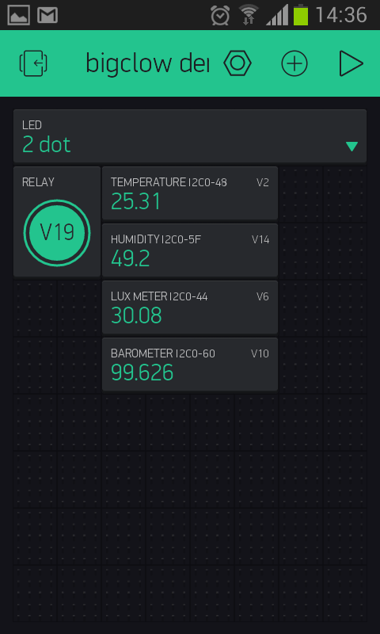
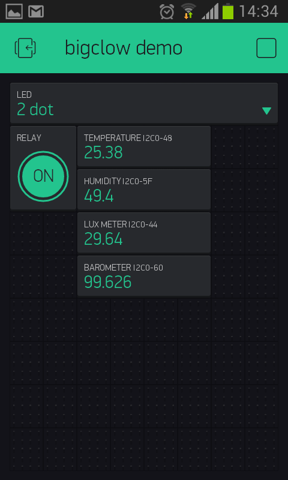

Blynk integration
=================

### 1. Install Blynk on your smartphone / tablet. Just use Google Play or AppStore.

### 2. Run Blynk and select "Create new project"

### 3. Give it a name (e.g. "bigclown demo") and select "Generic Board" as a hardware.

### 4. Write down your Auth Token (or let the application to send it to you by the E-mail)

### 5. Go to your Hub. Stop it by

`docker stop hub`

and remove running image by

`docker rm hub`

### 6. Re-run Docker with environmental parameter BLYNK_TOKEN

`docker run -d -p 80:80 -p 443:443 -p 1883:1883 --privileged -v /dev:/dev -v $HOME/hub:/var/hub -h hub-container --env BLYNK_TOKEN=da9d7ee58efabcdef123456789 --name hub clown/hub`

Notice the part `--env BLYNK_TOKEN=da9d7ee58efabcdef123456789` - you have to fill in your Blynk token you have obtained in step 3.

**Be careful!** Do not put this part AFTER the name! It will not work!

### 7. Create an Menu elemet for LED. Set output as virtual pin V1 (see below for pin assignment).

### 8. Create selections "on", "off", "1 dot", "2 dot" and "3 dot" as menu items.

### 9. Create relay button on pin V19

### 10. Create widgets for your sensors, i.e. humidity, temperature, lux-meter and barometer.

### 11. Now you have a working Blynk dashboard.

## Pin assignment for Blynk

| Virtual PIN | part of topic           | payload key       |                          |
|-------------|-------------------------|-------------------|--------------------------|
| 1           | led/-                   | state             | on,off,1-dot,2-dot,3-dot |
| 2           | thermometer/i2c0-48     | temperature       | °C                       |
| 3           | thermometer/i2c1-48     | temperature       | °C                       |
| 4           | thermometer/i2c0-49     | temperature       | °C                       |
| 5           | thermometer/i2c1-49     | temperature       | °C                       |
| 6           | lux-meter/i2c0-44       | illuminance       | lux                      |
| 7           | lux-meter/i2c1-44       | illuminance       | lux                      |
| 8           | lux-meter/i2c0-45       | illuminance       | lux                      |
| 9           | lux-meter/i2c1-45       | illuminance       | lux                      |
| 10          | barometer/i2c0-60       | pressure          | kPa                      |
| 11          | barometer/i2c0-60       | altitude          | m                        |
| 12          | barometer/i2c1-60       | pressure          | kPa                      |
| 13          | barometer/i2c1-60       | altitude          | m                        |
| 14          | humidity-sensor/i2c0-5f | relative-humidity | %                        |
| 15          | ---                     |                   |                          |
| 16          | humidity-sensor/i2c1-5f | relative-humidity | %                        |
| 17          | ---                     |                   |                          |
| 18          | co2-sensor/i2c0-38      | concentration     | ppm                      |
| 19          | relay/i2c0-3b           | state             | true, false              |
| 20          | relay/i2c0-3f           | state             | true, false              |